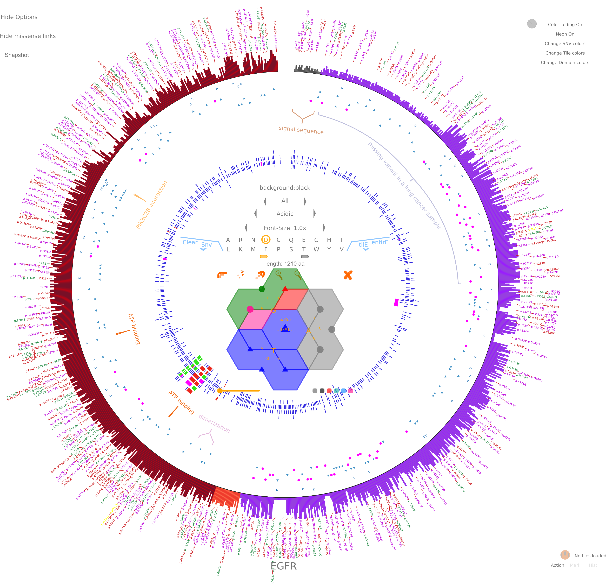

# I-PV

## Interactive Protein Sequence VIsualization/Viewer

This is the extracted I-PV folder which can also be downloaded from [I-PV official website](http://i-pv.org/ipv_minimal.html)

- Refer to the __./ipv/ReadMe.md__ for more detailed explanation on usage.

- You can visit [i-pv.org](http://i-pv.org/ipv_rec.html) or [here](./ipv/).

I-PV aims to unify protein features in a single interactive figure. It is easy to generate and
highly customizable. Data is checked and then plotted. When you publish figures with I-PV, I recommed you also
post the files in the datatracks folder as supplementary. 

In I-PV is designed to convey complex proteomics information to the audience in an interesting format. 

Below is a [sample output](http://i-pv.org/EGFR.html).

